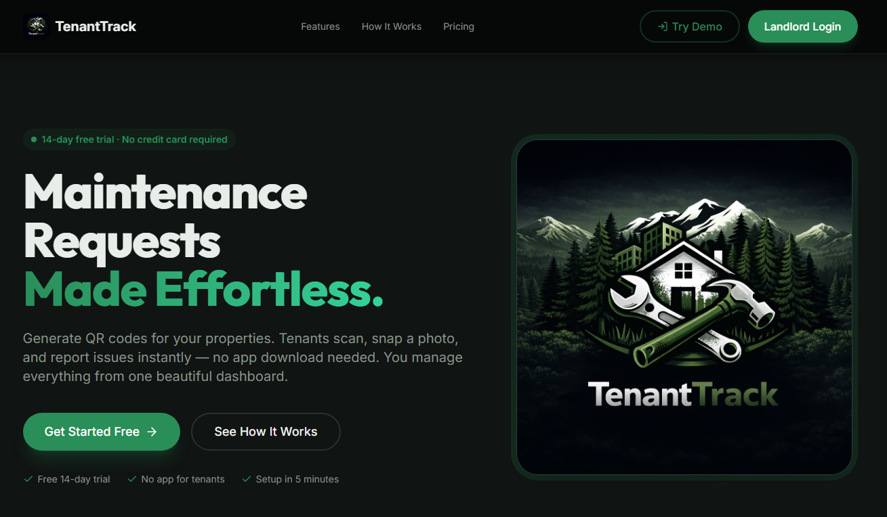
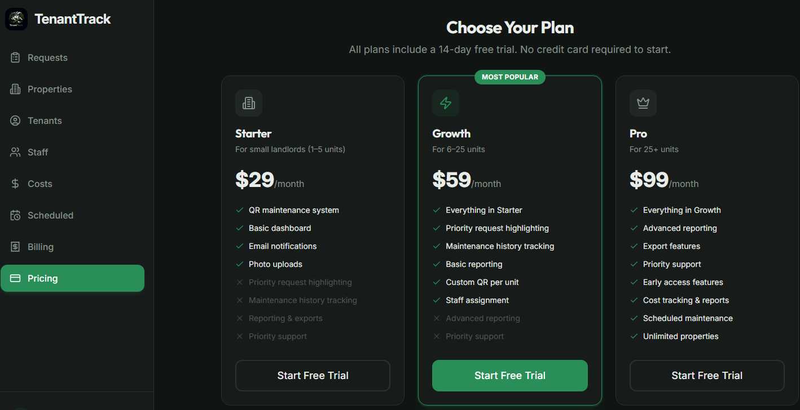
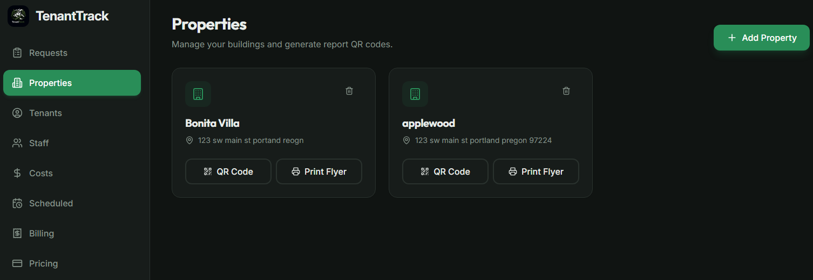
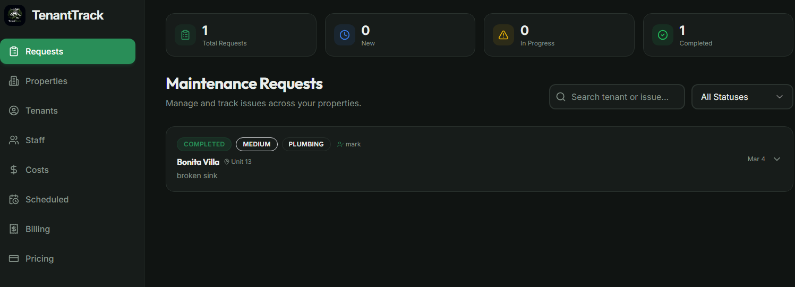
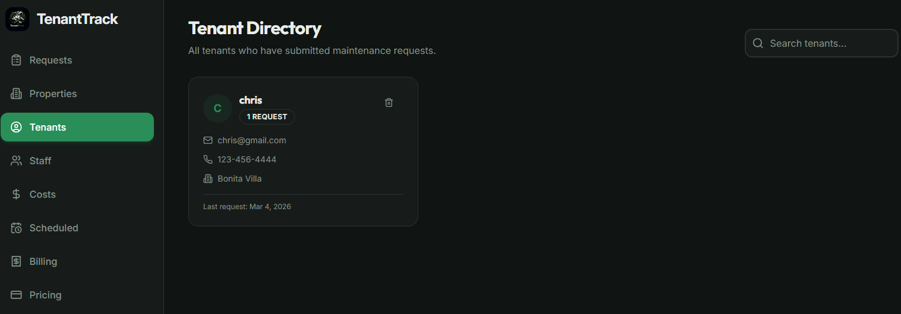
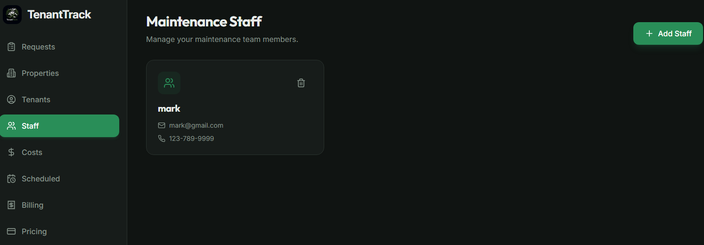
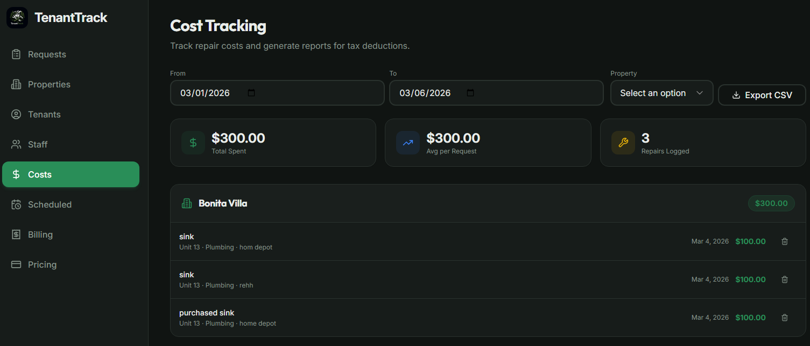
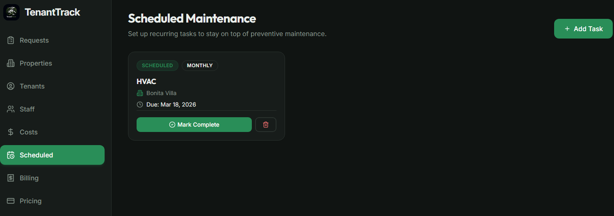
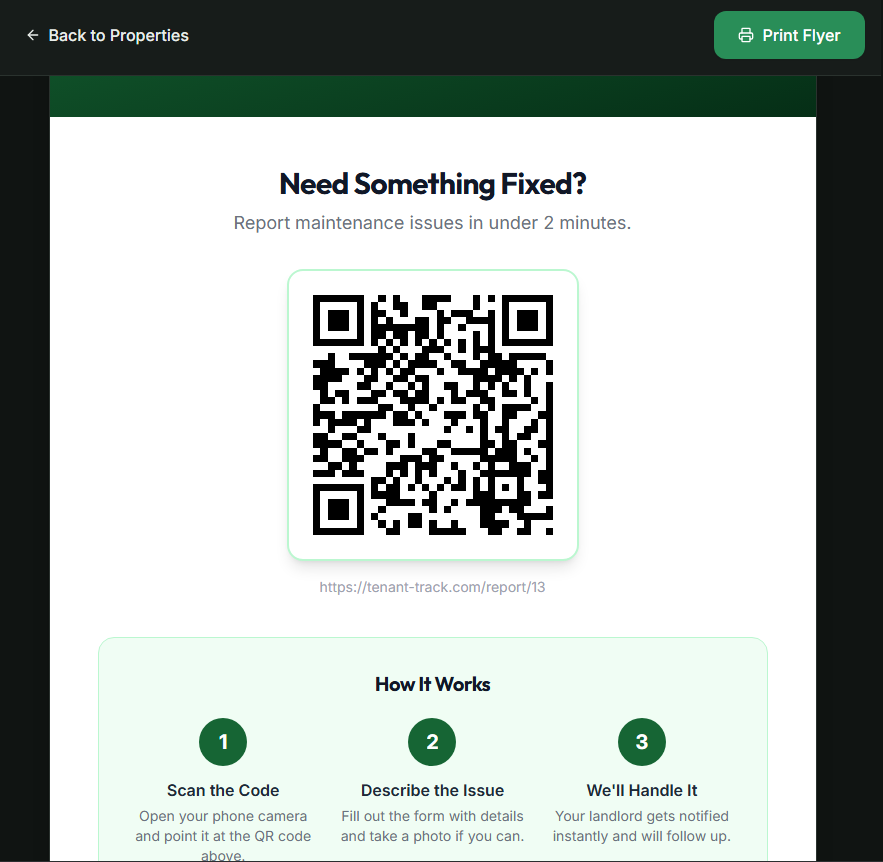

# TenantTrack

TenantTrack is a SaaS application that helps landlords manage tenant maintenance requests across multiple rental properties.

Tenants can submit repair requests with descriptions and photos while landlords track repairs, assign maintenance staff, and record costs through a centralized dashboard.  

---

## Demo Access

A demo account may be configured for demonstration purposes.

Example:

email: landlord@test.com  
password: demo123

---

## Features

- Tenant repair request submissions
- Property and unit management
- Maintenance request tracking
- Photo upload support
- Maintenance staff assignment
- Repair cost tracking
- Real-time updates
- Authentication system
- Stripe subscription integration (ready to configure)

---

## Tech Stack

Frontend
- React
- Vite
- TailwindCSS
- Radix UI

Backend
- Node.js
- Express
- TypeScript

Database
- PostgreSQL
- Drizzle ORM

Other Integrations
- Stripe (payments)
- Uppy (file uploads)
- WebSockets (real-time updates)

---

## Project Structure

client/ # React frontend
server/ # Express backend
db/ # Database schema and migrations
public/ # Static assets
package.json
vite.config.ts

---

## Getting Started

### 1. Clone the Repository

git clone https://github.com/YOUR_USERNAME/tenanttrack.git
cd tenanttrack

---

### 2. Install Dependencies

npm install

---

### 3. Configure Environment Variables

Create a `.env` file based on `.env.example`.

---

### 4. Start Development Server

npm run dev

---

### 5. Build for Production

npm run build
npm start

---

## Environment Variables

See `.env.example` for required configuration variables.

---

## Deployment Requirements

The application requires:

- Node.js
- PostgreSQL database
- Object storage (for file uploads)
- Environment variable configuration

It can be deployed on any standard Node hosting provider.

---

## Screenshots

### Landing Page

### Pricing

### Property Management

### Maintenance Requests

### Tenants Management

### Staff Management

### Cost Tracking

### Task Reminders

### Tenant QR Code Access

---

## License

MIT License

---

## Author

Built by Christopher Mayeaux.

This project is a vertical SaaS platform designed for landlords and property owners.
